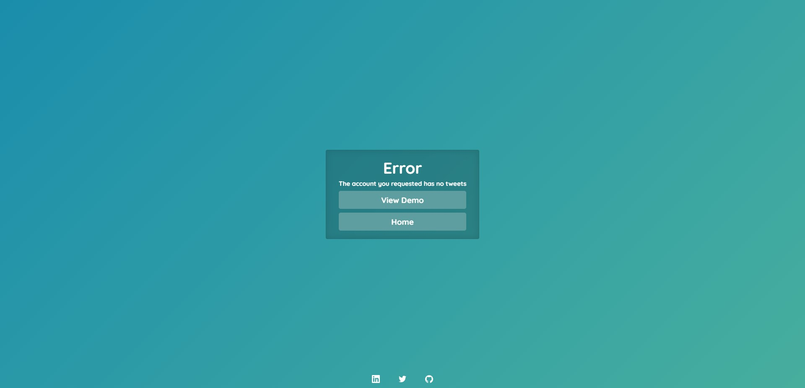
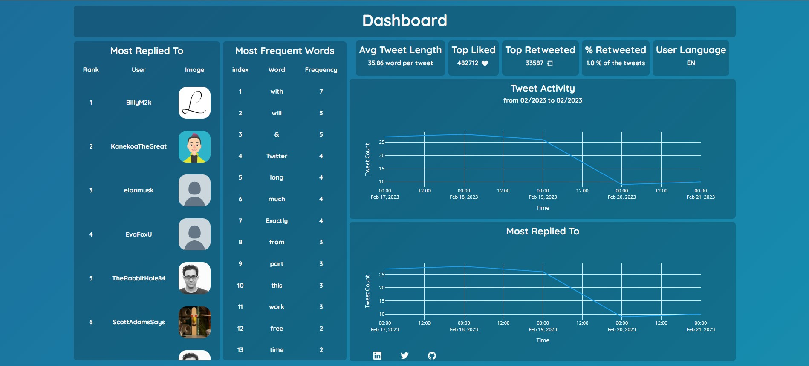

 

> # ⚠️Warning
> ##  This Project is still under Development  🛠️

  

  <h1>Twitter Profile Analytics</h1>
  

   Twitter Profile dashboard using TwitterAPI 1.1
  

<h4>
    <a href="https://github.com/">View Demo</a>
   · 
    <a href="https://github.com/">Documentation</a>
   · 
    <a href="https://github.com/">Report Bug</a>
   · 
    <a href="https://github.com/">Request Feature</a>
  </h4>

 

<!-- Table of Contents -->
# Table of Contents

- [About the Project](#about-the-project)

  * [Screenshots](#screenshots)
  * [Technologies Used](#tech-stack)
  * [Features](#features)

  * [Color Reference](#color-reference)
  * [Environment Variables](#environment-variables)

- [Contributing](#contributing)
- [Contact](#contact)
  

<!-- About the Project -->
# About the Project

<!-- Screenshots -->
## Screenshots

 
  
  
  
  

 
 

<!-- TechStack -->
# Tech Stack

 Client
  <ul>
  <li> </li>

  <li> </li>

  

  <li> </li>
    

  <li> </li>
    

  <li> </li>

  </ul>

Server
  <ul>
   <li><a href="https://flask.palletsprojects.com/en/2.2.x/"></li>

   <li> </li>
</a> 
  </ul>

  

<!-- Features -->
## Features

- Twitter User validation on the client side.
  
- Visuals:
  * Table of the users you are most interacting with
  
  * Table of the most used words and how frequent it has been used
  
  * Visual of the tweet activity for the past tweets (depending on Twitter API access type)
  
  * some metrics about the user, highest likes/retweet count, average tweet length, etc
   

  
- Error handling and redirecting to the error page with the right message.

- Optimized API requests

 
 

<!-- Color Reference -->
## Color Reference

| Color             | Hex                                                                |
| ----------------- | ------------------------------------------------------------------ |
| Primary Color |  #222831 |
| Secondary Color |  #393E46 |
| Accent Color |  #00ADB5 |
| Text Color |  #EEEEEE |

 
 

<!-- Env Variables -->
## Environment Variables

To run this project, have access to [TwitterAPI](https://developer.twitter.com/en) then add your tokens to `.env` file

- `CONSUNER_KEY`
- `CONSUMER_SECRET`
- `ACCESS_TOKEN`
- `ACCESS_TOKEN_SECRET`

 

 > <STRONG style ="color:red">DISCLAIMER: DON'T PUBLISH YOUR TOKENS PUBLICLY OR SHARE IT WITH ANYONE </STRONG>

 
 

<!-- Contributing -->
# Contributing

Contributions are always welcomed! 💻

See `contributing.md` for ways to get started.

 
 

<!-- License -->
# License

Distributed under the no License. See LICENSE.txt for more information.

 
 

<!-- Contact -->
# Contact

Twitter - [@nomadnasser](https://twitter.com/nomadnasser)

Linkedin - [Mohammed Nasser](https://https://www.linkedin.com/in/mohamed-nasser-38b045234/)

Github - [Elweday](https://github.com/elweday)

Mail - [Mohammed Nasser](Mohammednh2864@gmail.com)

 
 

